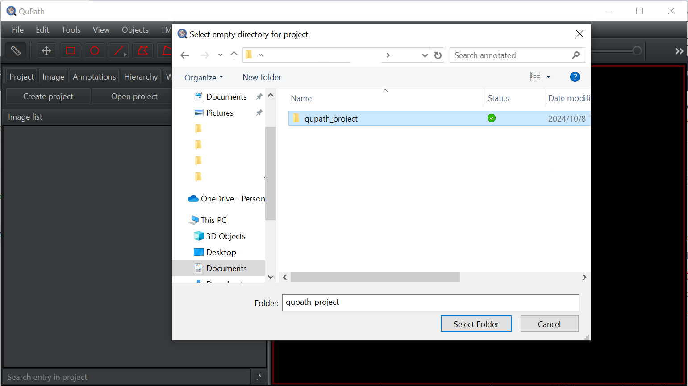
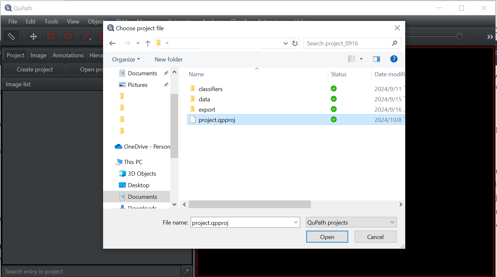
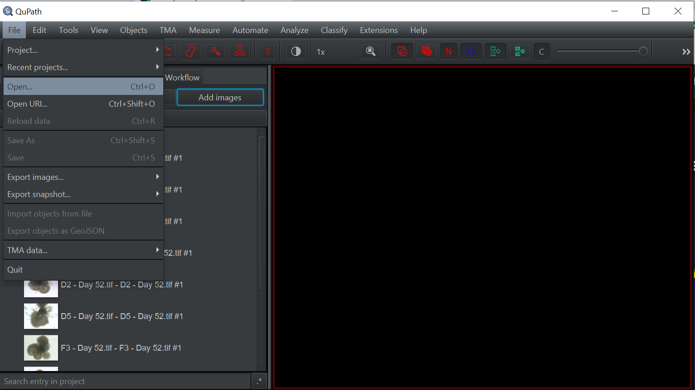
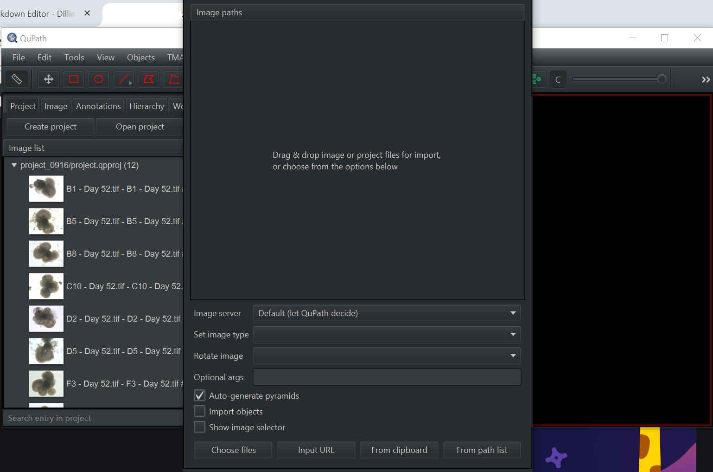
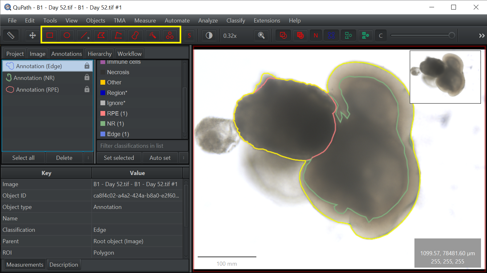
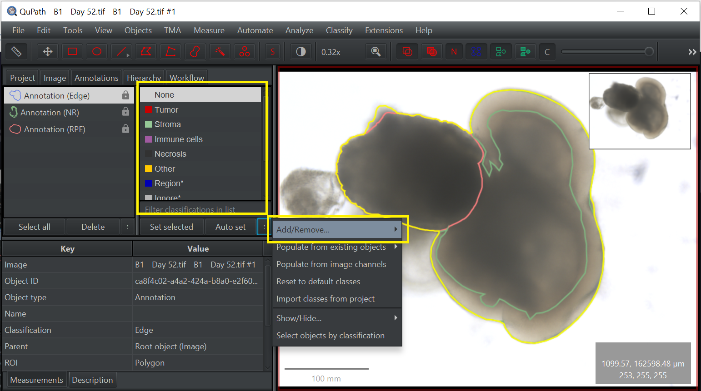
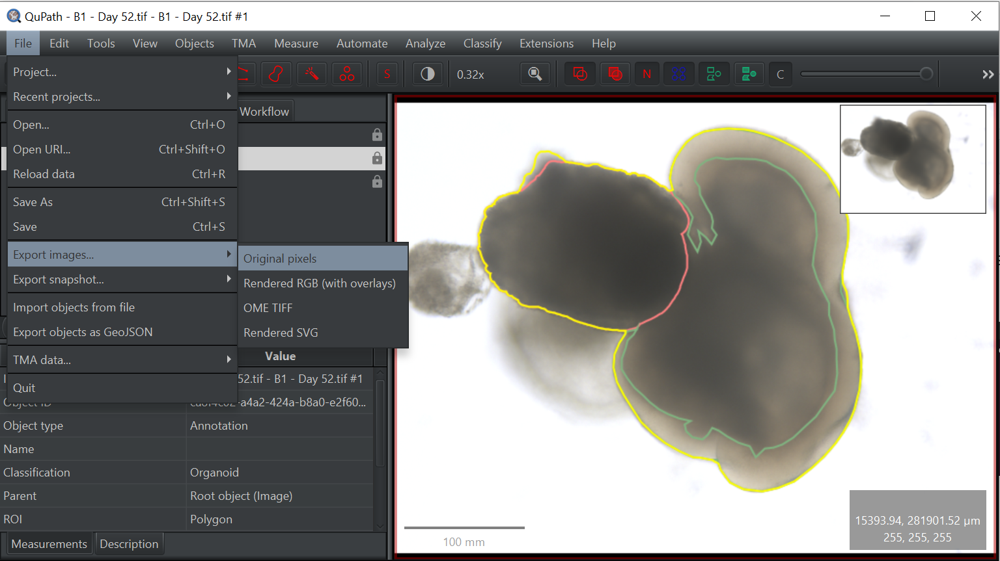
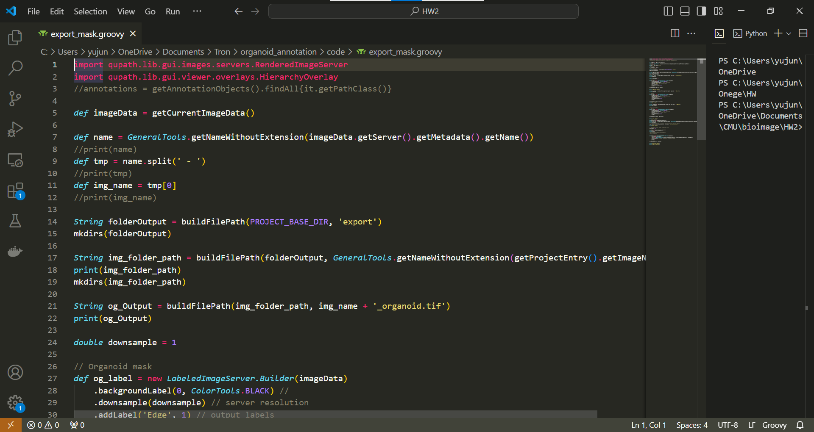
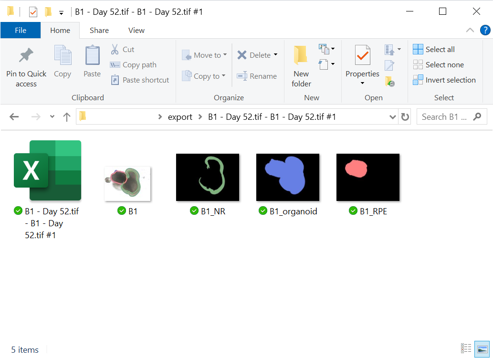

# Quick Guide: QuPath and export script  

By Yujung Lin  

- [QuPath](#qupath)  
- [Export Script](#export_script)  

----

## QuPath

QuPath is an open-source software platform designed for digital pathology image analysis. It provides powerful tools for working with whole slide images, including advanced machine learning algorithms, cell detection, tissue classification, and quantification of biomarkers. QuPath is widely used in biomedical research, enabling users to analyze complex histological images, streamline workflows, and extract meaningful insights from large datasets. Its flexibility and extensibility make it ideal for applications like cancer research, drug development, and pathology, allowing users to customize analyses and integrate with other bioimage tools.  

- **create/Open project**
 
    It is recommended to create individual projects for separate tasks in QuPath to keep details organized and avoid data mix-ups.

    To create a project, first, create an empty folder on your local machine where the project files will be stored. Next, click `Create Project` in QuPath and select the folder you just created to set up the new project. This will create a `.qpproj` file to store all the configurations of the current opened project. 
    
    
    
    To open an existing project, click `Open Project` and select the `.qpproj` file of the project you want to open.
    
    
    
- **Open images**

    To open images in a project, you can use `Add Images` or `File -> Open...` 
    
    
    
    
- **Annotation**
 
    QuPath has many different annotations tools (shapes) for you to annotate the images. You can adjust the shape of the annotation after you finished circling the targets.

    
    
    You can classify the annotations by selecting the pre-defined classifications or create a new class using the `Add/Remove...` tab under the three-dot tab.
    
    
    
    **Note:** For annotating Organoid, please use create class: RPE, NR, and Organoid. Case sensitivity is important as the class name is used in the export script.
    
## Export

There are 2 options to export images using QuPath. One is to use the built-in export features. The features can be found under `File -> Export images/Export snapshot`.

One thing to keep in mind is that, the built-in export features cannot export the annotations as a mask. The features only export images with overlay (annotations).  

The other export option is to use a custom script. An example export script is shown below. Using a custom script, you can define how images and annotations would be exported. In the example script, the annotations is exported as a binary mask. The script is available to download [here](export_mask.groovy).

### Script Walkthrough

The script is written to be run on a project. If you are not running the script during a project session, change the `PROJECT_BASE_DIR` in line 14 to the absolute path of the folder you want to use.

The script creates an `export` folder under the project directory (or the folder of your choice). In the `export` folder, a separate folder is created for each image exported. The script exports three masked images (NR, RPE, Organoid), a downsampled annotated png file of the images and a geojson file containing the information of all the ROIs. One can change the value of the `downsample` variable to the value they want.

To run the script, open the script editor in QuPath under `Automate -> Script editor` and open the script. To include default imports for every script, select the option under `Run -> Include default imports`. One can select if they want to run the script on one image or run the script on the entire project.

**Note:** Errors might occur for exporting downsample rendered images. If errors arise, remove `lineThickness` on line 95. If the error persists, block or remove code from line 83 to 101.
